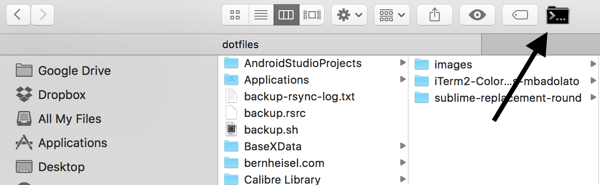

# Customizations (Dotfiles)

## Instructions

1. Install zprezto. https://github.com/sorin-ionescu/prezto
  ```bash
  zsh
  git clone --recursive https://github.com/sorin-ionescu/prezto.git "${ZDOTDIR:-$HOME}/.zprezto"
  setopt EXTENDED_GLOB
  for rcfile in "${ZDOTDIR:-$HOME}"/.zprezto/runcoms/^README.md(.N); do
    ln -s "$rcfile" "${ZDOTDIR:-$HOME}/.${rcfile:t}"
  done
  chsh -s /bin/zsh

  # Update the repositories this uses.
  cd ~/dotfiles/iTerm2-Color-Schemes && git pull && cd ~/dotfiles
  cd ~/dotfiles/fonts && git pull && cd ~/dotfiles
  ```

2. Run `bash install.sh`

3. Install fonts you want. I currently use Inconsolata-dz

4. Install iTerm2. https://www.iterm2.com

5. Install SublimeText3. https://www.sublimetext.com/3

6. Install SublimeText3 Package Control. https://packagecontrol.io/installation. Hit `` ctrl+` `` in SublimeText
  ```python
  import urllib.request,os,hashlib; h = '2915d1851351e5ee549c20394736b442' + '8bc59f460fa1548d1514676163dafc88'; pf = 'Package Control.sublime-package'; ipp = sublime.installed_packages_path(); urllib.request.install_opener( urllib.request.build_opener( urllib.request.ProxyHandler()) ); by = urllib.request.urlopen( 'http://packagecontrol.io/' + pf.replace(' ', '%20')).read(); dh = hashlib.sha256(by).hexdigest(); print('Error validating download (got %s instead of %s), please try manual install' % (dh, h)) if dh != h else open(os.path.join( ipp, pf), 'wb' ).write(by)
  ```

7. Setup themes: Afterglow in iTerm2, and Predawn in SublimeText.

8. Setup Sublime Text 3 plugins.

9. Replace icons as needed.

### cd to


https://github.com/jbtule/cdto

This small app will allow you to open up Terminal/iTerm from which folder you're currently at within Finder. This is essential!

## Sublime Text Icon Replacement


https://dribbble.com/shots/1827862-Yosemite-Sublime-Text-Icon

This just looks better in my dock. I like it.
Obviously, you'll need [Sublime Text](www.sublimetext.com/3)

## iTerm2
[iTerm2](https://iterm2.com/downloads.html) is great, and I use the beta version (at this time, 2.9.20151001 beta) because of El Capitan compatibility.

I use the Afterglow theme.

## Ruby Development

1. Install homebrew. http://brew.sh/
  ```bash
  sudo chown -R $(whoami):admin /usr/local # https://github.com/Homebrew/homebrew/blob/master/share/doc/homebrew/El_Capitan_and_Homebrew.md
  /usr/bin/ruby -e "$(curl -fsSL https://raw.githubusercontent.com/Homebrew/install/master/install)"
  brew update && brew update
  brew install ruby-build
  ```

2. Install rbenv and ruby. https://github.com/rbenv/rbenv
  ```bash
  git clone https://github.com/rbenv/rbenv.git ~/.rbenv
  cd ~/.rbenv && src/configure && make -C src
  # echo 'export PATH="$HOME/.rbenv/bin:$PATH"' >> ~/.zshrc
  # echo 'eval "$(rbenv init -)"' >> ~/.zshrc
  # This is already done in the in the zshrc file.
  ```

3. Install Ruby and some gems. Start a new iTerm session/tab
  ```bash
  GEMS=(bundle ruby-lint rubocop rails pry-rails rspec-rails httparty)
  rbenv install 2.3.0
  rbenv global 2.3.0
  echo "gem: --no-document" > ~/.gemrc # don't need no stinkin' documentation
  gem install ${GEMS[*]}
  ```

## JavaScript Development
1. Install homebrew. http://brew.sh/

  ```bash
  sudo chown -R $(whoami):admin /usr/local # https://github.com/Homebrew/homebrew/blob/master/share/doc/homebrew/El_Capitan_and_Homebrew.md
  /usr/bin/ruby -e "$(curl -fsSL https://raw.githubusercontent.com/Homebrew/install/master/install)"
  brew update && brew update
  ```

2. Install node and some packages

  ```bash
  brew install nodejs
  NODES=(npm jshint bower gulp wiredep http-server colors browserify browser-sync yo)
  npm install -g grunt-cli && echo "eval '$(grunt --completion=zsh)'" >> ~/.zshrc
  ```

## Sublime Text 3 Customization
### Settings
```json
{
  "ignored_packages":
  [
    "Vintage"
  ],
  "theme": "predawn-DEV.sublime-theme",
  "color_scheme": "Packages/Predawn/predawn.tmTheme",
  "predawn_tabs_active_underline": true,
  "predawn_tabs_medium": true,
  "predawn_sidebar_medium": true,
  "predawn_findreplace_small": true,
  "predawn_quick_panel_small": true,

  "bold_folder_labels": true,
  "draw_minimap_border": true,
  "draw_white_space": "selection",
  "highlight_line": true,
  "highlight_modified_tabs": true,

  "index_files": true,
  "tab_size": 2,
  "translate_tabs_to_spaces": true,
  "trim_trailing_white_space_on_save": true,

  "font_face": "Inconsolata-dz for Powerline",
  "font_options": "subpixel_antialias",
  "font_size": 14,

  "rulers": [
    80
  ],

}
```

### Enable Italics in iTerm2
1. `tic ~/dotfiles/xterm-256color-italic.terminfo`
1. Update iTerm2 profile terminal to report `xterm-256color-italic`
1. Restart iTerm2
1. Test with `` echo `tput sitm`italics`tput ritm` ``

### Plugins
1. Alignment
2. All Autocomplete
3. Better CoffeeScript
4. Emmet
5. ERB Snippets
6. Gist
7. Git
8. GitGutter
9. Indent XML
10. Sass
11. SideBarEnhancements
12. Markdown Preview


## GitX
This is a great tool that helps visualize the Git actions and histories when things start to get complicated. I also use this to discard hunks of code and review the changes before I commit.

Download here: https://rowanj.github.io/gitx/

Open and hit "Enable Terminal Usage", then you can just tye in `gitx` in whatever project you're in and get a nice UI of your repository.


# Good Articles

## Career
- https://web.archive.org/web/20140701091020/http://www.stefankendall.com/2013/11/10-questions-to-ask-your-potential.html
